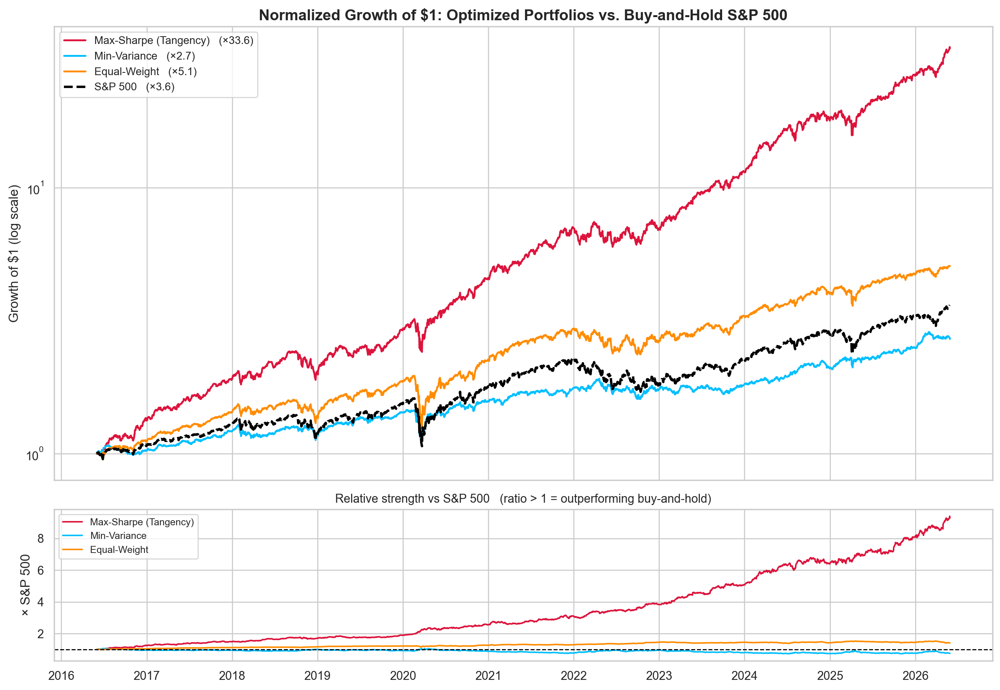
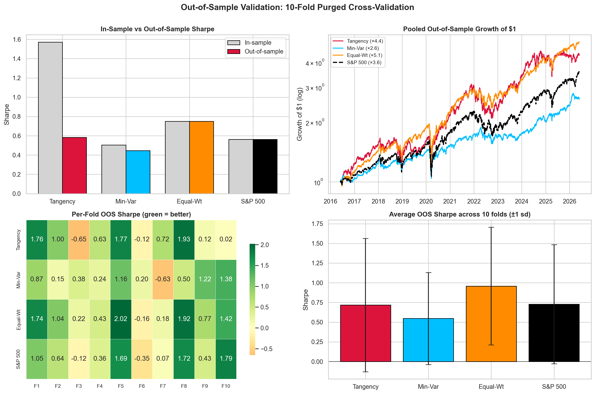

# Portfolio Optimization on the Efficient Frontier

**Mean-Variance Optimization & Monte Carlo Simulation over a 10-Year US Equity Universe**

**Author:** Michael-Nikolas Fotopoulos · **Date:** June 2026

---

## Overview

This project applies **Modern Portfolio Theory (MPT)** to a real, self-collected dataset — **213
US equities with complete 10-year daily histories (2016–2026)**, pulled from a personal EODHD
SQLite database (~2 GB). Instead of a small hand-picked basket, the **entire investable universe**
is optimized at once using two complementary engines, then the optimal portfolio is stress-tested
with portfolio-manager-grade risk analytics **and validated out-of-sample**.

1. **Monte Carlo simulation** — 500,000 random long-only portfolios map the feasible risk/return
   space, shaded by Sharpe ratio.
2. **Mean-Variance Optimization (MVO)** — the *analytical* efficient frontier is solved by
   quadratic programming, isolating the **Global Minimum-Variance** portfolio, the **Tangency
   (Max-Sharpe)** portfolio, and the **Capital Market Line**.
3. **Risk diagnostics, benchmarked vs. the S&P 500** — a full PM tear-sheet: Sharpe/Sortino/
   Calmar/Treynor, Beta/Alpha/Information-Ratio, up-/down-capture, VaR/CVaR, drawdown duration,
   normalized growth vs. buy-and-hold S&P 500, and rolling 1-year Sharpe.
4. **Out-of-sample validation** — a **10-fold purged cross-validation** that re-estimates the
   portfolios on each training split and scores them on held-out folds, exposing how much of the
   in-sample edge is real vs. overfit.


---

## Key Results

A full portfolio-manager tear-sheet (in-sample, 2016–2026), benchmarked against a **buy-and-hold
S&P 500 (^GSPC)** — which also serves as the market benchmark for Beta / Alpha / Information Ratio
/ Capture.

| Metric | **Tangency (Max-Sharpe)** | Min-Variance | Equal-Weight | **S&P 500** |
|---|---:|---:|---:|---:|
| **Growth of \$1** | **×33.6** | ×2.7 | ×5.1 | ×3.6 |
| CAGR | **42.2%** | 10.5% | 17.7% | 13.8% |
| Annualized volatility | 21.1% | 12.7% | 18.1% | 18.1% |
| **Sharpe** | **1.57** | 0.50 | 0.75 | 0.56 |
| Sortino | 2.10 | 0.63 | 0.89 | 0.67 |
| Calmar | 1.70 | 0.44 | 0.49 | 0.41 |
| Treynor | 0.33 | 0.12 | 0.14 | 0.10 |
| **Information ratio** | **2.20** | −0.33 | 0.79 | — |
| Max drawdown | −24.8% | −23.8% | −36.5% | −33.9% |
| Max DD duration | 169 d | 485 d | 372 d | 512 d |
| VaR 95% / CVaR 95% | −1.9% / −3.0% | −1.1% / −1.8% | −1.6% / −2.7% | −1.7% / −2.8% |
| Beta (vs S&P 500) | 1.01 | 0.55 | 0.98 | 1.00 |
| **Alpha (annual)** | **+22.8%** | +0.8% | +3.7% | 0.0% |
| Up / Down capture | 1.17 / 0.93 | 0.52 / 0.48 | 0.98 / 0.94 | 1.0 / 1.0 |
| Skew / Excess kurtosis | −0.07 / 7.3 | −0.66 / 14.9 | −0.54 / 18.2 | −0.38 / 16.0 |
| Hit rate (% up days) | 56.6% | 53.9% | 56.3% | 54.9% |

* **Risk-free rate ($R_f$):** 4.38% (10-Year Treasury, `^TNX`, with fallback)
* The **analytical tangency Sharpe (1.57)** exceeds the **best of 500,000 random portfolios
  (1.38)** — the optimizer provably beats brute-force search.
* **vs. buy-and-hold S&P 500:** the tangency portfolio turns \$1 into **\$33.6 vs the index's
  \$3.6** (≈9× the index) with a **+22.8% annual alpha**, **2.20 information ratio**, and
  **up-capture > down-capture** — at a *shallower* max drawdown (−24.8% vs −33.9%). Even naive
  equal-weight (×5.1) beats the index; min-variance (×2.7) trades return for the lowest risk.



### Optimal Allocation — Tangency Portfolio
`LLY 22.3%` · `PWR 12.5%` · `NVDA 12.0%` · `WMT 9.5%` · `PGR 9.1%` · `MU 6.1%` · `AXON 5.5%` ·
`AMD 5.4%` · `NEM 4.7%` · `LNG 4.6%` · *(+ smaller positions)*


---

## Out-of-Sample Validation (10-Fold Purged CV)

Everything above is **in-sample** — the optimizer saw the whole window before being scored on it,
and max-Sharpe optimization is notorious for overfitting expected returns. To separate skill from
hindsight, the portfolios are re-estimated under a **10-fold purged cross-validation** (contiguous
~1-year test folds, 5-day embargo) and scored only on **held-out** data. Equal-Weight and the S&P
500 estimate nothing, so they are identical in- and out-of-sample (a control).



| Avg across 10 OOS folds | Tangency | Min-Variance | Equal-Weight | **S&P 500** |
|---|---:|---:|---:|---:|
| Annualized return | 17.2% | 10.6% | 18.0% | 14.5% |
| **Sharpe** | 0.72 | 0.55 | **0.96** | 0.73 |
| Sortino | 1.02 | 0.77 | 1.27 | 0.98 |
| Max drawdown | −17.7% | −11.7% | −14.3% | −15.3% |

**Pooled OOS path (rebalanced each fold):** Tangency Sharpe **0.58**, alpha **+2.3%** (was +22.8%
in-sample), grows ×4.4 · Equal-Weight ×5.1 (Sharpe 0.75) · S&P 500 ×3.6 (0.56) · Min-Var ×2.6 (0.45).

### Verdict — is buy-and-hold S&P 500 better than MPT?
- **The tangency edge largely evaporates out-of-sample:** Sharpe **1.57 → ≈0.6**, alpha
  **+22.8% → ≈+2%**.
- **On average it only ties the index:** OOS Sharpe 0.72 vs the S&P's 0.73 — and the **S&P beats it
  in 3 of 10 folds** (and beats Min-Variance in **7/10**).
- **Equal-Weight is the real OOS winner** (Sharpe 0.96): the portfolio that estimates *nothing*
  carries no estimation error. **Min-Variance** is the most defensive — it wins the turbulent 2018
  and 2022 folds because it needs only the (stable) covariance, never the (noisy) mean.
- **Takeaway:** the more a portfolio leans on estimated expected returns, the less its in-sample
  brilliance survives contact with new data.

---

## Mathematical Framework

Long-only, fully-invested portfolio: $\sum_i w_i = 1,\; w_i \ge 0$.

| Quantity | Formula |
|---|---|
| Expected return | $E(R_p) = w^\top \mu$ |
| Volatility | $\sigma_p = \sqrt{w^\top \Sigma\, w}$ |
| Sharpe ratio | $\dfrac{E(R_p) - R_f}{\sigma_p}$ |

**Efficient frontier** (QP solved across target returns $R^\*$):

$$\min_{w}\; w^\top \Sigma\, w \quad \text{s.t.}\quad w^\top \mu = R^\*,\;\; \mathbf{1}^\top w = 1,\;\; w \ge 0$$

**Tangency portfolio** maximizes Sharpe over the simplex; combined with $R_f$ it defines the
**Capital Market Line** $\,E(R) = R_f + \text{Sharpe}^\* \cdot \sigma$.

---

## Data Engineering

The raw `prices` table stores **unadjusted** closes, so stock splits appear as fake one-day
crashes (NVIDIA's 2024 10-for-1 looks like −90%). The notebook **detects splits algorithmically**
— one-day price ratios that snap to an integer factor $k \ge 2$ are treated as corporate actions,
while normal "earnings-sized" moves are left untouched — then **back-adjusts** prices into a
continuous series. Across the universe **423 splits** were detected and corrected; only 7 of
535,269 daily-return cells required winsorizing.

---

## How to Run

```bash
pip install -r requirements.txt
jupyter notebook efficient_frontier.ipynb
```

The notebook reads from a local EODHD SQLite database if present; otherwise it falls back to the
**bundled split-adjusted price panel** (`data/universe_adj_close.csv.gz`) and the **bundled S&P 500
series** (`data/sp500.csv.gz`), so it runs end-to-end out of the box with no database or network
required.

---

## Caveats (Honest Limitations)

* **In-sample vs out-of-sample.** The headline tear-sheet is in-sample and overstates performance;
  the **purged-CV section quantifies it** (tangency Sharpe 1.57 → ≈0.6). Read the two together.
  Ledoit-Wolf covariance shrinkage and weight caps are the natural next improvements.
* **Survivorship bias.** The universe is *today's* survivors with full 10-year histories; delisted
  names are absent, inflating returns.
* **Estimation error.** Max-Sharpe weights are sensitive to noise in $\mu$; production use would
  add weight caps or resampled frontiers.
* **Price-return basis.** Portfolios and the S&P 500 are compared on a price (split-only) basis,
  excluding dividends, for a like-for-like comparison.

---

## Repository Structure

```
efficient_frontier.ipynb          # main analysis notebook
efficient_frontier.png            # Figure 1 — frontier + Monte Carlo + CML
risk_performance.png              # Figure 2 — drawdown / equity / VaR / correlations
growth_vs_sp500.png               # Figure 3 — normalized growth vs buy-and-hold S&P 500
rolling_sharpe.png                # Figure 4 — rolling 1-year Sharpe ratio
oos_purged_cv.png                 # Figure 5 — 10-fold purged CV (out-of-sample validation)
data/universe_adj_close.csv.gz    # bundled split-adjusted price panel (runs without the DB)
data/sp500.csv.gz                 # bundled S&P 500 benchmark series
requirements.txt
```
