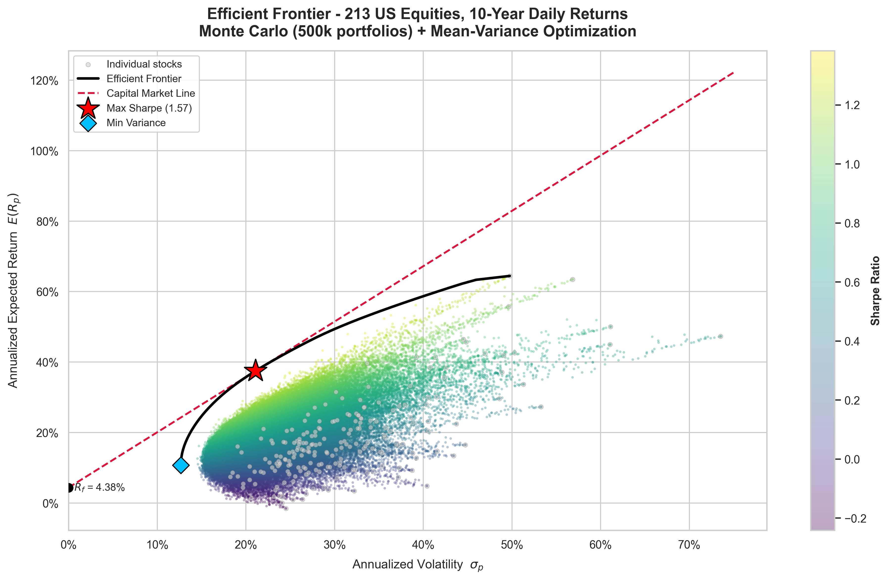
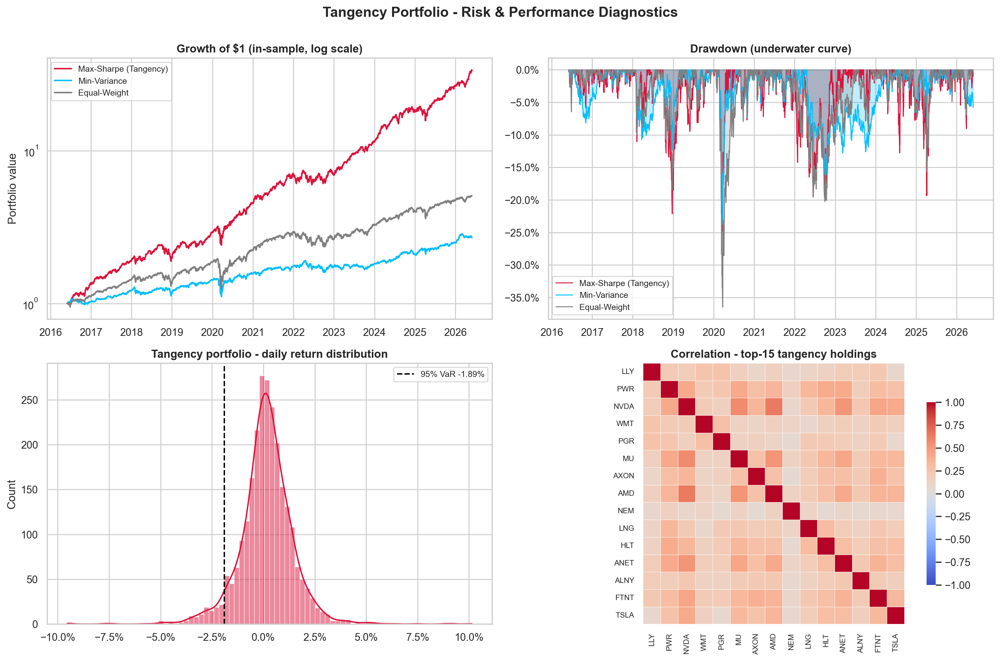
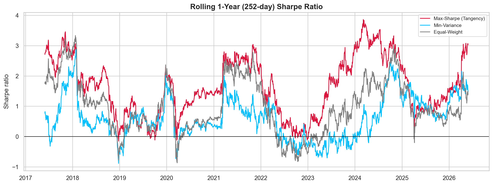

# Portfolio Optimization on the Efficient Frontier

**Mean-Variance Optimization & Monte Carlo Simulation over a 10-Year US Equity Universe**

**Author:** Michael-Nikolas Fotopoulos · **Date:** June 2026

---

## Overview

This project applies **Modern Portfolio Theory (MPT)** to a real, self-collected dataset — **213
US equities with complete 10-year daily histories (2016–2026)**, pulled from a personal EODHD
SQLite database (~2 GB). Instead of a small hand-picked basket, the **entire investable universe**
is optimized at once using two complementary engines, then the optimal portfolio is stress-tested
with portfolio-manager-grade risk analytics.

1. **Monte Carlo simulation** — 500,000 random long-only portfolios map the feasible risk/return
   space, shaded by Sharpe ratio.
2. **Mean-Variance Optimization (MVO)** — the *analytical* efficient frontier is solved by
   quadratic programming, isolating the **Global Minimum-Variance** portfolio, the **Tangency
   (Max-Sharpe)** portfolio, and the **Capital Market Line**.
3. **Risk diagnostics** — a full PM tear-sheet: Sharpe/Sortino/Calmar/Treynor, Beta/Alpha/
   Information-Ratio vs. a market proxy, up-/down-capture, VaR/CVaR, drawdown duration, equity &
   underwater curves, and rolling 1-year Sharpe.



---

## Key Results

A full portfolio-manager tear-sheet (in-sample, 2016–2026). Benchmark-relative metrics use an
equal-weighted index of the 213-name universe as the market proxy.

| Metric | **Tangency (Max-Sharpe)** | Min-Variance | Equal-Weight *(benchmark)* |
|---|---:|---:|---:|
| CAGR | **42.2%** | 10.5% | 17.7% |
| Annualized volatility | 21.1% | 12.7% | 18.1% |
| **Sharpe** | **1.57** | 0.51 | 0.75 |
| Sortino | 2.10 | 0.63 | 0.89 |
| Calmar | 1.70 | 0.44 | 0.49 |
| Treynor | 0.34 | 0.11 | 0.14 |
| **Information ratio** | **1.74** | −0.68 | — |
| Max drawdown | −24.8% | −23.8% | −36.5% |
| Max DD duration | 169 d | 485 d | 372 d |
| VaR 95% / CVaR 95% | −1.9% / −3.0% | −1.1% / −1.8% | −1.6% / −2.7% |
| Beta (vs mkt) | 0.98 | 0.57 | 1.00 |
| **Alpha (annual)** | **+19.7%** | −1.4% | 0.0% |
| Up / Down capture | 1.13 / 0.92 | 0.55 / 0.54 | 1.0 / 1.0 |
| Skew / Excess kurtosis | −0.07 / 7.3 | −0.66 / 14.9 | −0.54 / 18.2 |
| Hit rate (% up days) | 56.6% | 53.9% | 56.3% |

* **Risk-free rate ($R_f$):** 4.38% (10-Year Treasury, `^TNX`, with fallback)
* The **analytical tangency Sharpe (1.57)** exceeds the **best of 500,000 random portfolios
  (1.38)** — the optimizer provably beats brute-force search.
* The optimal portfolio earns a higher Sharpe **and** a shallower drawdown than equal-weight,
  with a **+19.7% annual alpha**, **1.74 information ratio**, and **up-capture > down-capture**.

### Optimal Allocation — Tangency Portfolio
`LLY 22.3%` · `PWR 12.5%` · `NVDA 12.0%` · `WMT 9.5%` · `PGR 9.1%` · `MU 6.1%` · `AXON 5.5%` ·
`AMD 5.4%` · `NEM 4.7%` · `LNG 4.6%` · *(+ smaller positions)*





---

## Mathematical Framework

Long-only, fully-invested portfolio: $\sum_i w_i = 1,\; w_i \ge 0$.

| Quantity | Formula |
|---|---|
| Expected return | $E(R_p) = w^\top \mu$ |
| Volatility | $\sigma_p = \sqrt{w^\top \Sigma\, w}$ |
| Sharpe ratio | $\dfrac{E(R_p) - R_f}{\sigma_p}$ |

**Efficient frontier** (QP solved across target returns $R^\*$):

$$\min_{w}\; w^\top \Sigma\, w \quad \text{s.t.}\quad w^\top \mu = R^\*,\;\; \mathbf{1}^\top w = 1,\;\; w \ge 0$$

**Tangency portfolio** maximizes Sharpe over the simplex; combined with $R_f$ it defines the
**Capital Market Line** $\,E(R) = R_f + \text{Sharpe}^\* \cdot \sigma$.

---

## Data Engineering

The raw `prices` table stores **unadjusted** closes, so stock splits appear as fake one-day
crashes (NVIDIA's 2024 10-for-1 looks like −90%). The notebook **detects splits algorithmically**
— one-day price ratios that snap to an integer factor $k \ge 2$ are treated as corporate actions,
while normal "earnings-sized" moves are left untouched — then **back-adjusts** prices into a
continuous series. Across the universe **423 splits** were detected and corrected; only 7 of
535,269 daily-return cells required winsorizing.

---

## How to Run

```bash
pip install -r requirements.txt
jupyter notebook efficient_frontier.ipynb
```

The notebook reads from a local EODHD SQLite database if present; otherwise it falls back to the
**bundled split-adjusted price panel** (`data/universe_adj_close.csv.gz`), so it runs end-to-end
out of the box with no database required.

---

## Caveats (Honest Limitations)

* **In-sample.** Expected returns and covariance are estimated on the same window used to score
  performance, so absolute Sharpe/return figures are an upper bound. Walk-forward validation and
  Ledoit-Wolf covariance shrinkage are the natural next steps.
* **Survivorship bias.** The universe is *today's* survivors with full 10-year histories; delisted
  names are absent, inflating returns.
* **Estimation error.** Max-Sharpe weights are sensitive to noise in $\mu$; production use would
  add weight caps or resampled frontiers.

---

## Repository Structure

```
efficient_frontier.ipynb          # main analysis notebook
efficient_frontier.png            # Figure 1 — frontier + Monte Carlo + CML
risk_performance.png              # Figure 2 — drawdown / equity / VaR / correlations
rolling_sharpe.png                # Figure 3 — rolling 1-year Sharpe ratio
data/universe_adj_close.csv.gz    # bundled split-adjusted price panel (runs without the DB)
requirements.txt
```
